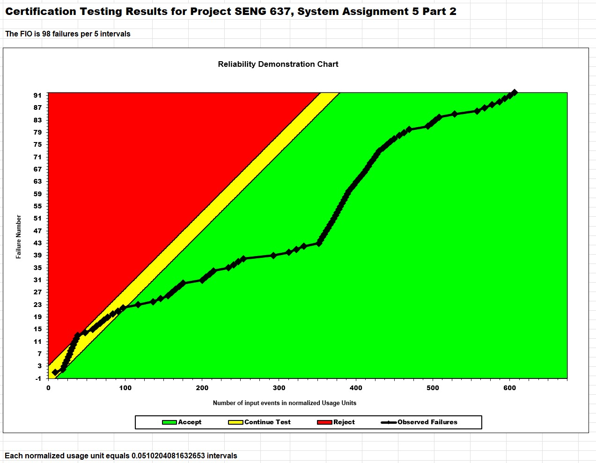

**SENG 637- Dependability and Reliability of Software Systems***

**Lab. Report \#5 – Software Reliability Assessment**

| Group \#:      |   11  |
| -------------- | --- |
| Student Names: |     |
|Steven Au       |     |
|Laurel Flanagan |     |
|Rhys Wickens    |     |
|Austen Zhang    |     |

# Introduction

# Assessment Using Reliability Growth Testing 

## Result of model comparison (selecting top two models)

## Result of range analysis

## Plots for failure rate and reliability of the SUT for the test data provided

## A discussion on decision making given a target failure rate

## A discussion on the advantages and disadvantages of reliability growth analysis

# Assessment Using Reliability Demonstration Chart 

## 3 plots for MTTFmin, twice and half of it for your test data

## Explain your evaluation and justification of how you decide the MTTFmin

## A discussion on the advantages and disadvantages of RDC

# Comparison of Results

# Discussion on Similarity and Differences of the Two Techniques

# How the team work/effort was divided and managed

# Difficulties encountered, challenges overcome, and lessons learned

# Comments/feedback on the lab itself
